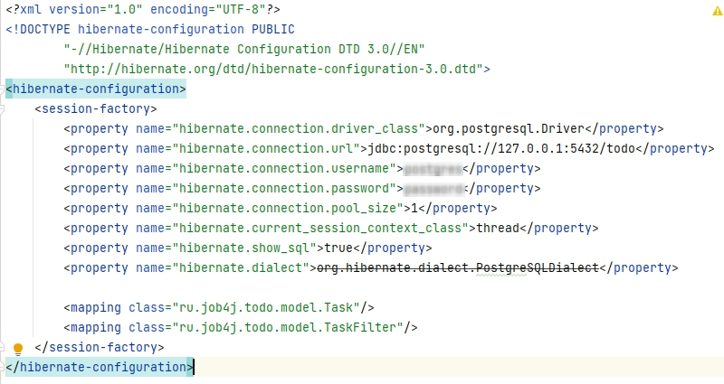
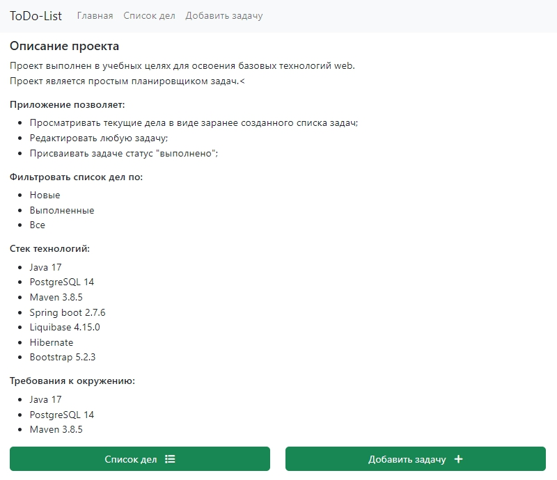
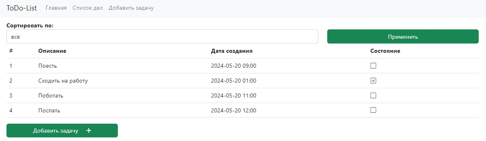
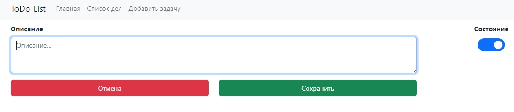

# Job4j_TODO
## Описание проекта
***
Проект выполнен в учебных целях для освоения базовых технологий web.
Проект является простым планировщиком задач. 

Приложение позволяет:
+ Просматривать текущие дела в виде заранее созданного списка задач;
+ Редактировать любую задачу;
+ Присваивать задаче статус "выполнено";
+ Фильтровать список дел по:
  + Новые
  + Выполненные
  + Все
***
## Стек технологий
- Java 17
- PostgreSQL 14
- Maven 3.8.5
- Spring boot 2.7.6
- Liquibase 4.15.0
- Hibernate
- Bootstrap 5.2.3
***
## Требования к окружению
- Java 17
- PostgreSQL 14
- Maven 3.8.5
***
## Запуск проекта
- создать базу данных с именем ***todo***
- прописать login/password в файле src/main/resources/hibernate.cfg.xml
  
- запустить метод *main* в классе *src/main/java/ru/job4j/todo/Main.java*
- после запуска сервера перейти на адрес: *http://localhost:8080/index*
***
## Контакты
yurchenkopi@gmail.com
***
## Скриншоты
>Главная страница

>Список всех задач

>Добавить новую задачу

>Редактировать задачу

